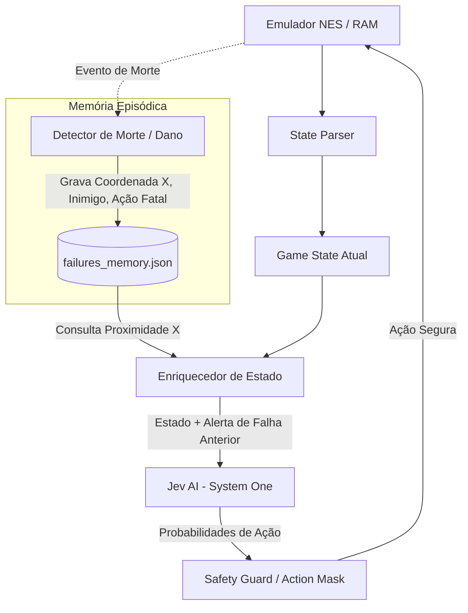

# ADR 0001: Aprendizado com Falhas via Memória Episódica Espacial e Máscara de Ações

- **Status:** Proposto
- **Data:** 2026-09-21
- **Decisores:** Time de Engenharia / Usuário
- **Contexto Técnico:** Super Mario Bros (NES), Jev AI (TypeSafe SDK), Python 3.10+

---

## 1. Contexto e Problema

O projeto integra o modelo **Jev AI** da TypeSafe como um controlador de decisão estruturada de baixa latência (*System One*) para o jogo *Super Mario Bros.*. O modelo consome telemetria extraída diretamente da RAM do emulador (posições X e Y, velocidades, presença de inimigos e buracos) e retorna em tempo real a melhor ação de controle (`Choice`) e o nível de perigo (`Score`).

No entanto, o Jev opera de maneira estritamente **sem estado (stateless)**:
1. Cada requisição ao `client.system_one(state=..., questions=...)` é independente.
2. O modelo não mantém memória de episódios ou partidas anteriores.
3. Se o Mario morrer ao colidir com um Goomba ou cair em um buraco executando uma ação (como `right_run`), em uma nova tentativa ele receberá o mesmo estado inicial de RAM e cometerá exatamente o mesmo erro, gerando um loop de falhas repetidas.

Precisamos de uma solução arquitetural que permita ao agente **aprender com os erros passados**, adaptando seu comportamento em novos episódios sem perder a característica de resposta rápida em tempo real (~300ms).

---

## 2. Decisão

Decidimos adotar uma **Arquitetura Híbrida de Memória Episódica Espacial** com **Injeção de Contexto no Estado** e **Salvaguarda por Máscara de Ação**, dividida em quatro componentes:



### 2.1. Componentes da Solução

1. **Rastreador de Falhas (`FailureTracker`):**
   - Monitora o término de vida do Mario (`dead=True` ou redução de `lives`).
   - Registra no momento da morte a tupla do evento em um armazenamento leve (`failures_memory.json`):
     ```json
     {
       "world": 1,
       "stage": 1,
       "x_pos": 316,
       "y_pos": 79,
       "fatal_action": "right_run",
       "hazard_type": "goomba",
       "timestamp": "2026-09-21T23:15:00Z"
     }
     ```

2. **Injeção de Contexto no Estado (In-Context Augmentation):**
   - Durante a execução, quando `Mario.x` entra em um raio de aproximação de uma falha anterior (ex: entre 30 e 60 pixels antes do ponto fatal), o payload do estado enviado ao Jev é enriquecido com um nó específico:
     ```json
     "hazard_memory": {
       "approaching_previous_failure": true,
       "fatal_coordinate_x": 316,
       "failed_action": "right_run",
       "hazard": "goomba",
       "directive": "A ação right_run causou a morte nesta mesma posição. Considere right_jump ou salto antecipado."
     }
     ```
   - O Jev avalia essa diretriz estruturada na ponderação de suas escolhas, recalculando as probabilidades para favorecer o salto ou recuo.

3. **Salvaguarda de Ação Local (`SafetyGuard / Dynamic Action Mask`):**
   - Se o modelo ainda assim sugerir a mesma ação fatal com probabilidade limítrofe no ponto crítico, o controlador local aplica uma penalidade na ação proibida, selecionando a segunda alternativa mais bem avaliada pela própria IA (ex: `right_jump`).

4. **Reflexão Assíncrona pós-episódio (*System Two*):**
   - Ao final do episódio, um script assíncrono lê os logs de telemetria existentes em `artifacts/run-*.jsonl` para consolidar lições aprendidas e evitar memorização excessiva (decay de falsos positivos).

---

## 3. Consequências

### Positivas
- **Aprendizado imediato entre mortes:** O agente não repete o mesmo erro na mesma coordenada geográfica.
- **Zero impacto na latência:** Não adiciona chamadas síncronas bloqueantes no loop de renderização do jogo; as consultas espaciais são feitas em memória local em < 1ms.
- **Não requer retreinamento de redes neurais:** O aprendizado ocorre via in-context learning estruturado e reponderação local de probabilidades.
- **Transparência e Auditabilidade:** Todo o histórico de erros e adaptações fica registrado em JSON legível para depuração.

### Negativas / Riscos Mitigados
- **Risco de Falsos Positivos:** O Mario pode morrer em um ponto por ter pulado cedo demais, e a memória registrar incorretamente que "pular foi o erro".
  - *Mitigação:* Armazenar o vetor de movimento completo (velocidade horizontal, se estava no ar, distância do inimigo) e não apenas a posição isolada.
- **Envelhecimento de Regras (Decay):** Se o agente ganha um Power-up (ex: Mario Grande ou Estrela), o risco de dano muda.
  - *Mitigação:* Associar o estado de poder (`powerup_status`) ao registro da falha.

---

## 4. Alternativas Consideradas

| Alternativa | Veredito | Motivo do Descarte / Aceite |
| :--- | :--- | :--- |
| **Fine-Tuning com DPO / RL clássico** | Descartado para o loop em tempo real | Exige infraestrutura de treino pesado, centenas de milhares de passos e inviabiliza adaptação instantânea na mesma sessão de jogo. |
| **Heurística Fixa sem IA (Hardcoded rules)** | Descartado | Remove o papel de decisão autônoma do Jev e torna o agente frágil a variações de fase. |
| **Reflexão Síncrona via LLM a cada Morte** | Descartado como mecanismo primário | Uma chamada síncrona a uma LLM a cada morte introduziria 2 a 5 segundos de espera, travando o ritmo da partida. Adotada apenas de forma assíncrona pós-jogo. |
| **Memória Episódica Espacial + State Augmentation** | **Aceito** | Combina a velocidade do System One com aprendizado contextual instantâneo em poucas linhas de código. |

---

## 5. Plano de Implementação

1. **Fase 1:** Criar classe `FailureMemory` para gravação e consulta de mortes por coordenada `(world, stage, x_pos)`.
2. **Fase 2:** Integrar a verificação de proximidade espacial no parser de estado antes do envio para a API Jev.
3. **Fase 3:** Implementar o `SafetyGuard` para reponderação de probabilidades em caso de reincidência.
4. **Fase 4:** Testar no Mundo 1-1 contra o primeiro Goomba e primeiro abismo, validando a superação do obstáculo na 2ª tentativa.
